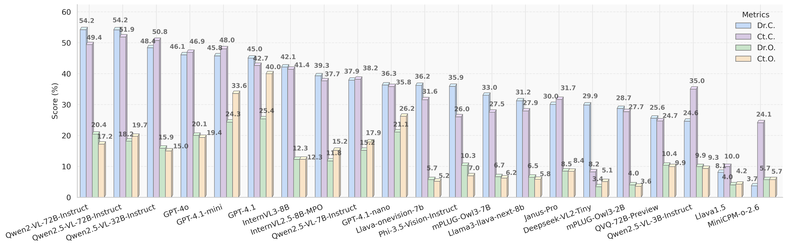

# HSSBench: Benchmarking Humanities and Social Sciences Ability for Multimodal Large Language Models

[🐙 GitHub Page](https://github.com/Zhaolu-K/HSSBench)  [🤗 HSSBench](https://huggingface.co/datasets/dozo/HSSBench)

## 💡 Introduction
Current benchmarks for evaluating MLLMs primarily emphasize general knowledge and vertical step-by-step reasoning typical of STEM disciplines, while overlooking the distinct needs and potential of the Humanities and Social Sciences (HSS). Tasks in the HSS domain require more horizontal, interdisciplinary thinking and a deep integration of knowledge across related fields, which presents unique challenges for MLLMs, particularly in linking abstract concepts with corresponding visual representations. Addressing this gap, we present HSSBench, a dedicated benchmark designed to assess the capabilities of MLLMs on HSS tasks in multiple languages, including the six official languages of the United Nations. We also introduce a novel data generation pipeline tailored for HSS scenarios, in which multiple domain experts and automated agents collaborate to generate and iteratively refine each sample.

## 📊 Model Performance
We test the  model performance under 2 scenarios: (1)Directly OR CoT answer, and (2) Multi-choice OR Open.

### Directly Performance

## 🛠️ Model Evaluation

### Environment
First, you need to install the necessary dependencies:
```bash
pip install openai tqdm pandas
```
Then configure the OpenAI service information in your code:
```python
API_KEY = "your OpenAI API key"
ENDPOINT = 'https://your-openai-endpoint.com/'
ENGINE = 'your model name'
api_version = "API version"
```

### Data Format Requirements
The input JSON file should contain question data in the following format:
```json
{
    "id": "question ID",
    "question": "question content",
    "category": "subject category",
    "correct_answer": "correct answer",
    "options": {
        "A": "content of option A",
        "B": "content of option B",
        "C": "content of option C",
        "D": "content of option D"
    },
    "results": {
        "model name": {
            "output": "answer generated by the model"
        }
    }
}
```

### Command Line Arguments
When using this tool, various options can be configured through command line arguments:
```bash
python main.py --input input_file.json --output output_file.json --use-gpt --max-distance 50 --accuracy-csv accuracy_stats.csv --open-questions open_questions_list.jsonl
```

Main parameters:
- `--input`: Required parameter, can specify multiple input JSON file paths
- `--output`: Optional parameter, specifies output JSON file paths, must match the number of input files
- `--use-gpt`: Whether to use GPT for evaluation (uses regex matching by default)
- `--max-distance`: Maximum allowed character distance from the end when using regex matching (default 50)
- `--accuracy-csv`: Path to save the CSV file containing accuracy statistics for all models
- `--open-questions`: Path to the open-ended questions JSONL file (optional)

### Multiple-Choice Questions Evaluation Example
Assuming we have a multiple-choice question dataset file `choice_questions.json`, use GPT to evaluate and save the results:
```bash
python main.py --input choice_questions.json --output choice_questions_eval.json --use-gpt --accuracy-csv choice_accuracy.csv
```

### Open-Ended Questions Evaluation Example
For open-ended questions, you need to provide a JSONL file specifying the question IDs to evaluate:
```bash
python main.py --input open_questions.json --open-questions open_question_ids.jsonl --output open_questions_eval.json --use-gpt --accuracy-csv open_accuracy.csv
```

### Batch Processing Multiple Model Results
If you need to evaluate results from multiple models simultaneously, you can use:
```bash
python main.py --input model1_results.json model2_results.json --output model1_eval.json model2_eval.json --use-gpt --accuracy-csv all_models_accuracy.csv
```

### Regular Expression Evaluation Mode
If you don't want to use GPT for evaluation, you can use the regex-based evaluation mode:
```bash
python main.py --input questions.json --output questions_eval.json --max-distance 30
```
In this mode, the tool will look for answer options in the last 30 characters of the model output.

### Viewing Evaluation Results
After evaluation, you can view detailed assessment results for each question in the output JSON file, and also check the accuracy statistics by subject category in the CSV file.
The tool will also generate a text format accuracy statistics report for quick result viewing.
